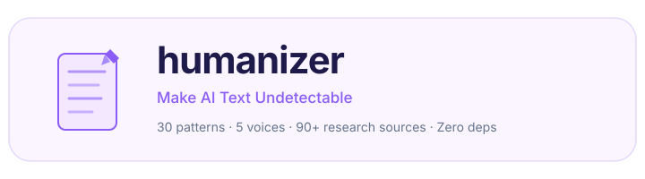
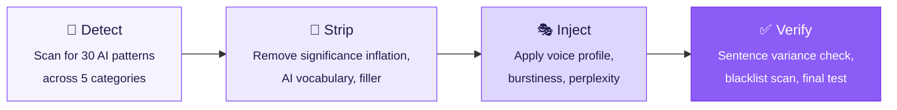

<picture>
  <source media="(prefers-color-scheme: dark)" srcset=".github/assets/logo-dark.svg">
  <source media="(prefers-color-scheme: light)" srcset=".github/assets/logo-light.svg">
  
</picture>

<p align="center">
  <a href="LICENSE"></a>
  <a href="skills/humanizer/SKILL.md"></a>
  <a href="#-voice-profiles"></a>
  <a href="#"></a>
  <a href="#"></a>
  <a href="https://github.com/Aboudjem/humanizer-skill/stargazers"></a>
</p>

<p align="center">
  <b>Your writing quality, measured and fixed. Not just word-swapped.</b><br/>
  <sub>Drop-in Claude Code skill. 30 AI patterns detected. 5 voice profiles. Zero dependencies.</sub>
</p>

---

<br/>

## What is this?

You write with AI. The output sounds like a chatbot. Every sentence is the same length, the vocabulary is predictable, and phrases like "delve into" and "it's important to note" show up everywhere.

**Humanizer** is a Claude Code skill that detects 30 specific AI writing patterns and rewrites your text with real human rhythm, vocabulary, and voice. It doesn't swap synonyms. It rebuilds sentences from the ground up, injecting the burstiness and unpredictability that make writing sound like an actual person wrote it.

```bash
# Install (one command, zero config)
mkdir -p .claude/skills/humanizer && curl -sL \
  https://raw.githubusercontent.com/Aboudjem/humanizer-skill/main/skills/humanizer/SKILL.md \
  -o .claude/skills/humanizer/SKILL.md
```

That's it. No config. No dependencies. Claude Code picks it up automatically.

> [!TIP]
> This is about **writing quality**, not detection evasion. Good writing doesn't trigger AI detectors because it doesn't exhibit the lazy patterns that detectors look for. Fix the writing, and the detection problem solves itself.

<br/>

## Before and after

### Technical documentation

> **Before:**
> This comprehensive guide delves into the intricacies of our authentication system. The platform leverages cutting-edge JWT technology to provide a seamless, secure, and robust authentication experience. Additionally, it features a pivotal role-based access control system that serves as a testament to our commitment to security.

> **After** (`--voice technical`):
> The auth system uses JWTs. Tokens expire after 15 minutes; refresh tokens last 7 days. Role-based access control restricts API endpoints by user role: admin, editor, and viewer each see different data. The token rotation logic is in `src/auth/refresh.ts` if you need to change the expiry windows.

*Killed 9 AI patterns. Added real details. Cut word count by 40%.*

### Blog post

> **Before:**
> In today's rapidly evolving technological landscape, artificial intelligence is reshaping how we think about creativity. This groundbreaking shift represents a pivotal moment in human history, one that underscores the intricate interplay between innovation and artistic expression.

> **After** (`--voice casual`):
> I've been messing around with AI image generators for about six months now, and I still can't decide if I love them or if they make me uneasy. The outputs are technically impressive. I got a portrait last week that looked better than anything I could paint in a year. But there's something missing. It's like eating a perfect-looking meal that has no flavor.

*Replaced abstract commentary with personal experience. Sentence lengths: 8, 31, 22, 4, 13 words. That's burstiness.*

### LinkedIn post

> **Before:**
> Excited to announce that I've taken on a pivotal new role at TechCorp! This incredible opportunity represents a significant milestone in my professional journey. I'm deeply grateful to my amazing network for their unwavering support. #NewBeginnings #Innovation #Leadership #Grateful

> **After** (`--voice professional`):
> Started a new job at TechCorp this week. I'm leading their developer tools team, 12 engineers building internal tooling that currently serves about 400 developers. First week has been drinking from the firehose: new codebase, new faces, new coffee machine I can't figure out. Nervous and excited in roughly equal measure.

*No emojis. No hashtags. Real details instead of "pivotal milestone." The coffee machine line is more human than any amount of gratitude signaling.*

<br/>

## How it works



Your text goes in. Clean, human-sounding writing comes out. The skill auto-detects which patterns are present and applies the minimum transformation needed to fix them.

<br/>

## 🚀 Quick start

| Step | Action |
|:----:|:-------|
| **1** | Install the skill: `mkdir -p .claude/skills/humanizer && curl -sL https://raw.githubusercontent.com/Aboudjem/humanizer-skill/main/skills/humanizer/SKILL.md -o .claude/skills/humanizer/SKILL.md` |
| **2** | Use it: `/humanizer "Your AI-generated text here"` |
| **3** | Pick a voice: `/humanizer "text" --voice casual` |

> [!NOTE]
> Claude Code detects skills in `.claude/skills/`, `~/.claude/skills/`, or any plugin's `skills/` directory. No restart needed.

<br/>

## 🎯 Three modes

| Mode | What it does | When to use |
|:-----|:-------------|:------------|
| `rewrite` | Full transformation with voice injection | Content creation, blog posts, social media |
| `detect` | Scan-only report with pattern counts and severity | Auditing existing content, learning what to fix |
| `edit` | In-place file editing with minimal changes | Documentation cleanup, README polishing |

> [!IMPORTANT]
> `rewrite` is the default mode. You don't need to specify it.

<br/>

## 🗣️ Voice profiles

Every voice changes how the skill rewrites, not just what words it picks but the sentence structure, rhythm, and personality it injects.

| Voice | Personality | Best for |
|:------|:-----------|:---------|
| 🗨️ `casual` | Contractions, first person, fragments, "And" starters | Blog posts, social media, community docs |
| 💼 `professional` | Selective contractions, dry wit, concrete examples | Business comms, reports, formal docs |
| ⌨️ `technical` | Precise terms, code-like clarity, deadpan humor | API docs, READMEs, architecture docs |
| 🤝 `warm` | "We/our" language, empathy, shorter paragraphs | Tutorials, onboarding, support content |
| 🔪 `blunt` | Shortest sentences, no hedging, active voice only | Reviews, internal comms, direct feedback |

<br/>

## 🧬 The science

AI detectors don't use magic. They measure two things, and both are well-documented in published research.

**Burstiness** is sentence length variation. Humans write a 3-word sentence, then a 40-word one, then a 12-word one. AI writes every sentence at roughly 18 words. Detectors measure this variance. Low variance = probably AI.

**Perplexity** is word predictability. AI picks the most statistically likely next word every time. Humans don't. We use surprising words, odd phrasing, personal references. High perplexity = probably human.

Word-swapping tools like QuillBot change individual words but leave the rhythm and predictability untouched. That's why they fail. You need **structural transformation**, not synonym replacement.

| Technique | Source | Finding |
|:----------|:-------|:--------|
| ⚡ Burstiness injection | GPTZero[^1] | Human sentence length varies wildly. AI doesn't. |
| 🎲 Perplexity increase | GPTZero[^1] | AI picks the most statistically likely next word. |
| 📊 Vocabulary diversity | SSRN stylometric study[^2] | Human TTR: 55.3 vs AI: 45.5 |
| ❌ Kill negative parallelism | Washington Post[^3] | "It's not X, it's Y" confirmed as #1 AI tell across 328K messages |
| 🔄 Structural paraphrasing | RAID benchmark, ACL 2024[^4] | Drops DetectGPT accuracy from 70.3% to 4.6% |
| 📐 Intrinsic dimension | NeurIPS 2023[^5] | Human text ~9 dimensions vs AI ~7.5 |

[^1]: GPTZero detection methodology: perplexity and burstiness as core signals
[^2]: SSRN stylometric study comparing type-token ratios across human and AI corpora
[^3]: Washington Post analysis of 328,744 ChatGPT messages identifying distinctive AI constructs
[^4]: RAID: A Shared Benchmark for Robust Evaluation of Machine-Generated Text Detectors (ACL 2024, 6M+ generations)
[^5]: Tulchinskii et al., NeurIPS 2023: Intrinsic dimensionality estimation for AI text detection

<br/>

## ⚔️ vs. alternatives

| Feature | **Humanizer** | QuillBot | Undetectable.ai | Manual editing |
|:--------|:------------:|:--------:|:----------------:|:--------------:|
| Open source | ✅ | ❌ | ❌ | N/A |
| Pattern detection | ✅ **30** | ❌ 0 | ❌ 0 | ❌ 0 |
| Voice profiles | ✅ **5** | ❌ 0 | ❌ 3 | Manual |
| Works offline | ✅ | ❌ | ❌ | ✅ |
| Burstiness injection | ✅ | ❌ | Partial | ❌ |
| File editing mode | ✅ | ❌ | ❌ | ❌ |
| Explains changes | ✅ | ❌ | ❌ | ❌ |
| Price | ✅ **Free** | $20/mo | $10/mo | Free |

<br/>

## 🤔 Why not just...

**"...use a better prompt?"**
Prompts help, but they can't enforce 30 specific pattern rules consistently. The skill has a checklist. It catches things you'd miss on your 50th revision.

**"...use QuillBot or Undetectable.ai?"**
They swap words. The rhythm stays robotic, the sentence lengths stay uniform, the structure stays predictable. Detectors don't care about individual words. They care about patterns.

**"...just edit it myself?"**
You absolutely can. But do you know all 30 patterns? Can you spot "copula avoidance" or "significance inflation" on sight? This skill is a ruthless editor that never gets tired and never misses a pattern.

<br/>

## 🔒 Trust

No telemetry. No data collection. No API calls. No cloud anything.

The entire skill is a single Markdown file (`SKILL.md`) that Claude Code reads locally. Your text never leaves your machine. There's nothing to audit because there's nothing running.

> [!NOTE]
> Pure markdown skill. No JavaScript, no binaries, no network requests. Read the source yourself: it's one file.

<br/>

## 📋 All 30 patterns

<details>
<summary><b>Content Patterns (P1-P8)</b> - the worst offenders</summary>
<br/>

| # | Pattern | What to look for |
|:--|:--------|:-----------------|
| P1 | Significance Inflation | "marking a pivotal moment", "is a testament to" |
| P2 | Notability Name-Dropping | "featured in", "active social media presence" |
| P3 | Superficial -ing Phrases | "highlighting", "ensuring", "fostering" |
| P4 | Promotional Language | "cutting-edge", "seamless", "world-class", "nestled" |
| P5 | Vague Attributions | "Experts argue", "Research suggests" (no citation) |
| P6 | Formulaic Challenges | "Despite challenges, continues to thrive" |
| P7 | AI Vocabulary | "delve", "leverage", "multifaceted", "tapestry" |
| P8 | Copula Avoidance | "serves as" instead of "is" |

</details>

<details>
<summary><b>Language and Style (P9-P18)</b> - structural tells</summary>
<br/>

| # | Pattern | What to look for |
|:--|:--------|:-----------------|
| P9 | Negative Parallelisms | "It's not just X, it's Y" |
| P10 | Rule of Three | Forced triads: "innovation, inspiration, and insights" |
| P11 | Synonym Cycling | "protagonist" then "main character" then "central figure" |
| P12 | False Ranges | "From X to Y" on non-spectrums |
| P13 | Em Dash Ban | Zero em dashes allowed, replace with commas/hyphens |
| P14 | Boldface Overuse | Bold on every noun, emoji headers |
| P15 | Structured List Syndrome | `**Header:** description` bullets for prose content |
| P16 | Title Case Headings | "Strategic Negotiations And Global Partnerships" |
| P17 | Typographic Tells | Curly quotes, consistent Oxford comma |
| P18 | Formal Register Overuse | "it should be noted that", "it is essential to" |

</details>

<details>
<summary><b>Communication (P19-P21)</b> - chatbot residue</summary>
<br/>

| # | Pattern | What to look for |
|:--|:--------|:-----------------|
| P19 | Chatbot Artifacts | "I hope this helps!", "Certainly!" |
| P20 | Knowledge-Cutoff Disclaimers | "As of [date]", "based on available information" |
| P21 | Sycophantic Tone | "Great question!", "That's an excellent point!" |

</details>

<details>
<summary><b>Filler and Hedging (P22-P30)</b> - dead weight</summary>
<br/>

| # | Pattern | What to look for |
|:--|:--------|:-----------------|
| P22 | Filler Phrases | "In order to", "Due to the fact that", "It's worth noting" |
| P23 | Excessive Hedging | "could potentially possibly" |
| P24 | Generic Conclusions | "The future looks bright", "poised for growth" |
| P25 | Hallucination Markers | Fabricated-feeling dates, phantom citations |
| P26 | Perfect/Error Alternation | Inconsistent quality = partial AI edit |
| P27 | Question-Format Titles | "What makes X unique?", "Why is Y important?" |
| P28 | Markdown Bleeding | `**bold**` in emails, Word docs, social posts |
| P29 | "Comprehensive Overview" | "This guide delves into...", "Let's dive in" |
| P30 | Uniform Sentence Length | Every sentence 15-25 words, no variation |

</details>

<br/>

## 📂 Install options

> [!TIP]
> The skill is a single file. No config, no setup, no dependencies. Claude Code picks it up automatically.

**Option 1: Project-scoped** (recommended, travels with your repo):

```bash
git clone https://github.com/Aboudjem/humanizer-skill.git
cp -r humanizer-skill/skills/humanizer .claude/skills/
rm -rf humanizer-skill
```

**Option 2: Global** (available in every project):

```bash
mkdir -p ~/.claude/skills/humanizer
curl -sL https://raw.githubusercontent.com/Aboudjem/humanizer-skill/main/skills/humanizer/SKILL.md \
  -o ~/.claude/skills/humanizer/SKILL.md
```

**Option 3: Inside an existing plugin:**

```bash
cp -r skills/humanizer /path/to/your-plugin/skills/
```

<br/>

## 📁 File structure

```
your-project/
  .claude/
    skills/
      humanizer/
        SKILL.md    # <- the entire skill, one file
```

<br/>

## 🤝 Contributing

Found a new AI pattern? Have a better fix? PRs welcome.

1. Fork the repo
2. Add your pattern to `SKILL.md` (follow the P1-P30 format)
3. Include a before/after example
4. Open a PR

See [CONTRIBUTING.md](CONTRIBUTING.md) for details.

<br/>

## 📚 Research sources

<details>
<summary><b>90+ sources across academic research, editorial expertise, and community intelligence</b></summary>
<br/>

- [Wikipedia: Signs of AI writing][wiki-ai], 24 pattern categories with real examples
- [Wikipedia FR: Identifier l'usage d'une IA generative][wiki-fr], additional AI pattern research
- RAID Benchmark (ACL 2024), 6M+ generations, 12 detectors evaluated
- NeurIPS 2023, intrinsic dimension analysis (Tulchinskii et al.)
- Washington Post, 328,744 ChatGPT message analysis
- Stanford HAI, ESL false positive study
- Max Planck Institute, AI vocabulary frequency spikes
- Softaworks agent-toolkit humanizer by [@blader](https://github.com/softaworks/agent-toolkit)
- William Strunk Jr., *The Elements of Style*
- Gary Provost, David Ogilvy, Ann Handley, professional writing craft
- GPTZero detection methodology (perplexity + burstiness)
- SSRN stylometric studies (type-token ratio analysis)
- ICLR 2024 watermarking and detection papers
- Reddit r/ChatGPT, r/ArtificialIntelligence community pattern discoveries
- HackerNews discussions on AI detection and writing quality
- Professional editorial firms' AI content guidelines

</details>

<br/>

---

<p align="center">
  If this skill saved your writing from sounding like a chatbot, consider giving it a star.<br/>
  It helps others find it.
</p>

---

<p align="center">
  <a href="https://www.linkedin.com/in/adam-boudjemaa/"></a>
  <a href="https://x.com/AdamBoudj"></a>
  <a href="https://adam-boudjemaa.com/"></a>
</p>

<p align="center">
  <sub>Built by <a href="https://github.com/Aboudjem">Adam Boudjemaa</a> · MIT License · No telemetry · No data collection</sub>
</p>

[wiki-ai]: https://en.wikipedia.org/wiki/Wikipedia:Signs_of_AI_writing
[wiki-fr]: https://fr.wikipedia.org/wiki/Aide:Identifier_l%27usage_d%27une_IA_g%C3%A9n%C3%A9rative
